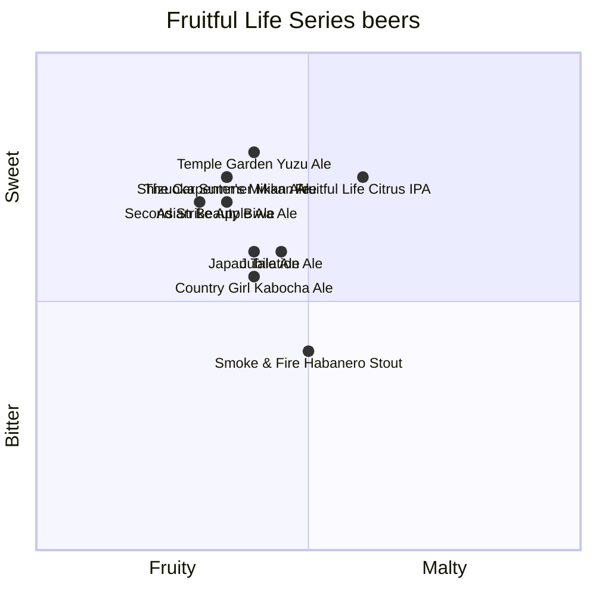

# Fruitful Life Series beer quadrant

The following Baird Beers are available only during certain parts of the year until they sell out. These beers are available at Baird Taprooms or in bottles.

:::note

Scores for each beer were created by GPT-4 from OpenAI and reviewed by a [human](https://github.com/josh-wong).

:::

## Beers and their descriptions

The following are descriptions for each of the beers in the quadrant.

### The Carpenter's Mikan Ale

This refreshing ale is brewed with fresh mikan oranges, offering a bright, citrusy aroma and flavor that pairs harmoniously with a light malt backbone, perfect for easy drinking.

### Temple Garden Yuzu Ale

Infused with aromatic yuzu fruit, this ale delivers a crisp and tangy citrus flavor, complemented by a subtle malt sweetness, making it a zesty and invigorating experience.

### Second Strike Apple Ale

Brewed with fresh apples, this ale offers a crisp apple flavor with a balanced sweetness and a hint of tartness, making it a fruit-forward beer that’s both refreshing and complex.

### Fruitful Life Citrus IPA

A hop-forward IPA enhanced with citrus fruits like orange and lemon, this beer bursts with juicy, fruity flavors and a solid bitterness, creating a lively and refreshing drinking experience.

### Shizuoka Summer Mikan Ale

This summer ale showcases the vibrant flavors of local mikan oranges, providing a juicy, citrusy profile with a light, thirst-quenching body that’s perfect for warm weather.

### Japan Tale Ale

A unique ale brewed with native Japanese fruits, offering a delicate balance of sweetness and tartness with subtle malt undertones, creating a beer that tells a story of Japan’s rich fruit heritage.

### Asian Beauty Biwa Ale

This ale is brewed with biwa (loquat) fruit, offering a delicate and slightly sweet flavor with hints of apricot and peach, balanced by a gentle malt character.

### Country Girl Kabocha Ale

A seasonal ale brewed with kabocha (Japanese pumpkin), providing a rich, earthy flavor with notes of roasted squash and a touch of sweetness, perfect for autumn.

### Smoke & Fire Habanero Stout

This bold stout combines rich, roasted malt flavors with the fiery heat of habanero peppers, delivering a unique and spicy twist on the classic stout profile.

### Jubilation Ale

A festive ale brewed with seasonal spices and fruits, offering a complex blend of warm, spiced flavors with a fruity sweetness, making it a perfect beer for celebratory occasions.
