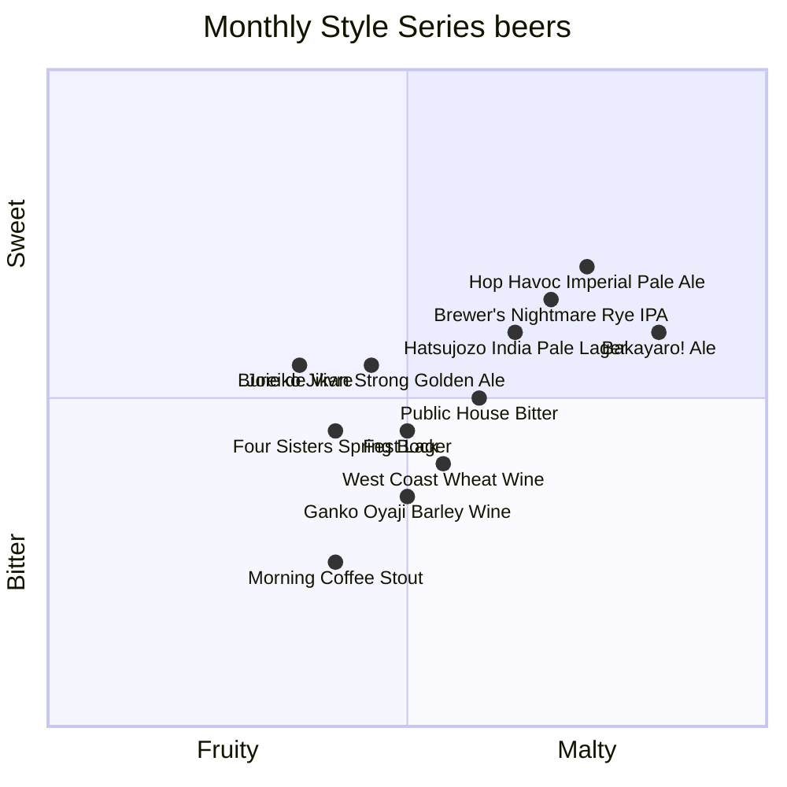

# Monthly Style Series beer quadrant

The following Baird Beers are available only during certain months or until they sell out. These beers are available at Baird Taprooms or in bottles.

:::note

Quadrant rankings and descriptions for each beer were created by GPT-4 from OpenAI and reviewed by a [human](https://github.com/josh-wong).

:::

## Beers and their descriptions

The following are descriptions for each of the beers in the quadrant.

### Hatsujozo India Pale Lager

A crisp and refreshing lager with a robust hop profile, this India Pale Lager combines the clean finish of a lager with the bold, fruity bitterness typical of an IPA.

### Ganko Oyaji Barley Wine

This strong and complex barley wine boasts rich flavors of caramel, toffee, and dark fruit, with a warming alcohol presence and a lingering bitterness that balances its sweetness.

### Morning Coffee Stout

A rich, dark stout brewed with freshly roasted coffee beans, delivering bold coffee aromas and flavors, complemented by roasted malt and a smooth, creamy finish.

### Bureiko Jikan Strong Golden Ale

This golden ale is robust and full-bodied, with a fruity and spicy character, balanced by a solid malt backbone and a warming alcohol presence.

### Four Sisters Spring Bock

A traditional bock beer with a rich malt profile, offering smooth caramel and toasty flavors, balanced by a light bitterness and a slightly sweet finish.

### Hop Havoc Imperial Pale Ale

This imperial pale ale is aggressively hopped, delivering intense citrus and pine flavors, backed by a strong malt presence that balances the high bitterness.

### Joie de Vivre

A refreshing and lively ale with a fruity and floral hop character, balanced by a smooth malt base, making it a vibrant and easy-drinking beer.

### Public House Bitter

A classic English-style bitter with a balanced malt and hop profile, offering toasty and caramel malt flavors with a gentle bitterness, perfect for a sessionable pint.

### Brewer's Nightmare Rye IPA

A bold IPA brewed with rye malt, adding a spicy complexity to the citrusy and piney hop flavors, resulting in a unique and flavorful beer.

### Fest Lager

A smooth and malty lager, inspired by traditional German festbiers, with a rich, bready malt profile and a clean, balanced finish, making it ideal for celebration.

### West Coast Wheat Wine

A strong and complex wheat wine with bold hop flavors, delivering a unique combination of wheat malt sweetness and intense hop bitterness, typical of the West Coast style.

### Bakayaro! Ale

This strong ale is fiercely bitter with a powerful hop presence, balanced by a robust malt backbone, making it an intense and flavorful experience for the adventurous beer drinker.
