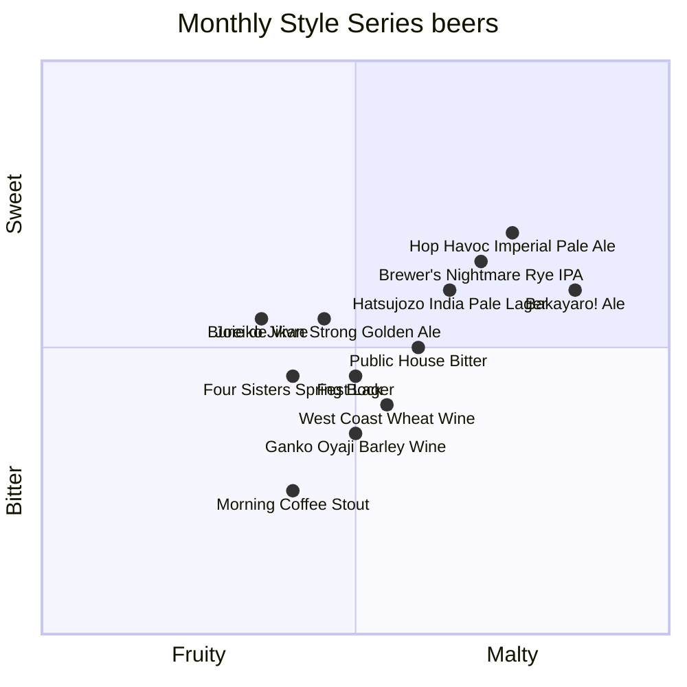

# Monthly Style Series beer quadrant

The following Baird Beers are available only during certain months or until they sell out. These beers are available at Baird Taprooms or in bottles.

:::note

Scores for each beer were created by GPT-4 from OpenAI and reviewed by a [human](https://github.com/josh-wong).

:::

## Beers and their descriptions

### 

### 

