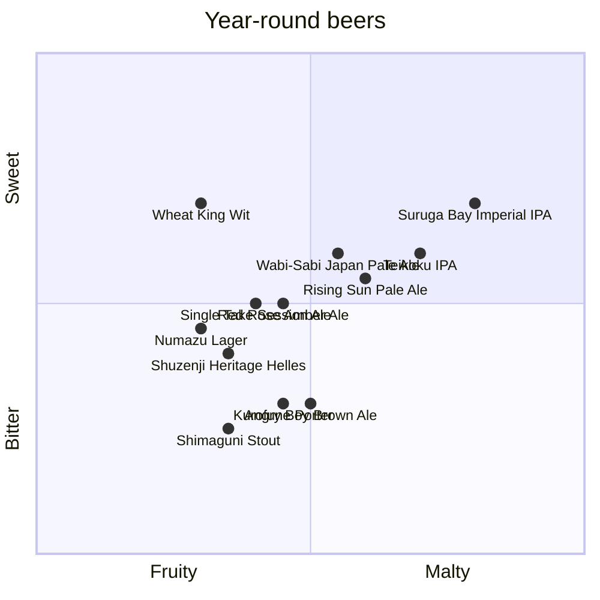

# Year-Round beer quadrant

The following Baird Beers are available year round. These beers are available at Baird Taprooms or in bottles.

:::note

Scores for each beer were created by GPT-4 from OpenAI and reviewed by a [human](https://github.com/josh-wong).

:::
