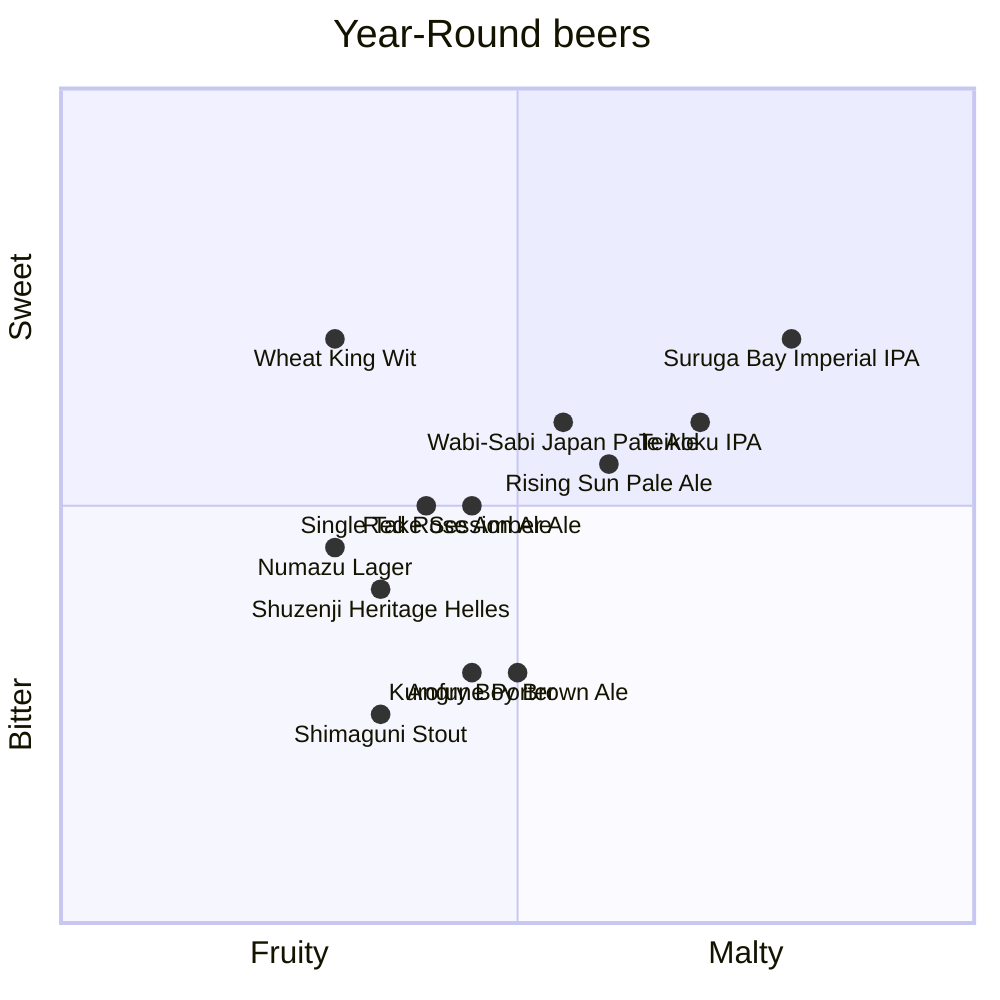

# Year-Round beer quadrant

The following Baird Beers are available year round. These beers are available at Baird Taprooms or in bottles.

:::note

Scores for each beer were created by GPT-4 from OpenAI and reviewed by a [human](https://github.com/josh-wong).

:::

## Beers and their descriptions

The following are descriptions for each of the beers in the quadrant.

### Single Take Session Ale

A crisp and easy-drinking session ale with light malt flavors and a refreshing hop bitterness, making it a perfect choice for a laid-back drinking experience.

### Wheat King Wit

A Belgian-style witbier brewed with wheat, orange peel, and coriander, offering a light and refreshing body with bright citrus and spice notes, ideal for warm weather.

### Shuzenji Heritage Helles

A classic German-style Helles lager with a clean, malt-forward profile, offering smooth and bready flavors with a mild hop bitterness and a crisp finish.

### Numazu Lager

A well-balanced, easy-drinking lager with a light malt sweetness and a gentle hop bitterness, delivering a clean and refreshing taste.

### Rising Sun Pale Ale

A vibrant pale ale with a citrusy and floral hop character, balanced by a solid malt backbone, making it a flavorful yet approachable beer.

### Wabi-Sabi Japan Pale Ale

A unique pale ale brewed with Japanese wasabi and green tea, offering a refreshing blend of earthy, herbal, and slightly spicy flavors with a crisp hop finish.

### Red Rose Amber Ale

A malt-forward amber ale with rich caramel and toasty flavors, balanced by a mild hop bitterness, creating a smooth and satisfying drinking experience.

### Angry Boy Brown Ale

A robust brown ale with deep malt flavors of chocolate and caramel, complemented by a moderate bitterness and a touch of roasted character.

### Teikoku IPA

A traditional English-style India Pale Ale that features a well-balanced blend of malt sweetness and hop bitterness. It offers earthy and floral hop aromas, complemented by caramel and toasty malt flavors, delivering a robust yet smooth drinking experience.

### Suruga Bay Imperial IPA

A bold and hop-forward imperial IPA with intense citrus and pine aromas, backed by a strong malt presence that balances its high bitterness.

### Shimaguni Stout

A rich and full-bodied stout with complex roasted malt flavors, including coffee and dark chocolate, balanced by a smooth, creamy finish.

### Kurofune Porter

A classic porter with a deep, dark malt profile, offering flavors of chocolate, coffee, and a hint of smoke, finished with a moderate hop bitterness.
